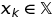

# nsopy -- Non-Smooth Optimization in Python

A set of first-order methods for solving

when
* f(x) is convex, but not necessarily differentiable (has "kinks")
* the set  is convex (and "simple"?)

They are of particular interest in the context of decomposing some large scale 
optimization problems via Lagrangian duality. 

#### Implemented Methods

## Usage Examples

The inputs required are
* a first-order oracle of the problem, which, for a given  
returns function value  and a subgradient   
* a projection function onto 

## Advanced Applications

## References

#### Papers
* papers
#### Other Resources
* link to other methods

- write README (why; list of methods with refs and naming; 2 analytical examples showing how to use; how to use loggers and util to record as csv (utils))
--> is max, I keep it max; max f(x) s.t. x \in X, where: f convex not necessarily smooth; X any convex, or just simple (need to be able to project)?
--> only works for simple sets X

- make bertsekas analytical example

Python implementations of several first-order methods for solving the dual problems arising in the
context of **dual decomposition** of
 * Stochastic (Mixed Integer) Optimization Models
 * Markov Random Fields (with discrete labels)

Methods' efficacy is assessed in terms of number of necessary oracle calls.
In particular we are interested in how the more recently proposed methods
* ??
* ??
stack against traditional options like subgradient, cutting plane and bundle methods.
See ???PAPER DRAFT for a more detailed explanation.

# Usage

To see usage examples, please check the iPython notebooks in `./notebooks/`. ???LINK

Non-pip libraries required to run the notebooks locally:
* ???LINK gurobipy
* ???LINK opengm (with Python interface)
