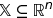
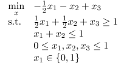

# nsopy -- Non-Smooth Optimization in Python

A set of first-order methods for solving

when
* f(x) is convex, but not necessarily differentiable (has "kinks")
* the set  is convex (and "simple"?)

**Note**: all the methods have been implemented to solve the equivalent problem of 
*maximizing* a concave (non-smooth) function. This is because the main application intended is to 
solve dual problems of minimizations, which naturally arise as maximizations. 
See [basic example on duality](notebooks/Application to Duality.ipynb).

### Basic Usage Examples
* [Solving a Simple Analytical Problem](notebooks/Analytical Example.ipynb).
 
* [Lagriangian Duality](notebooks/Application to Duality.ipynb). Taking advantage of duality to simplify hard problems. 
Applied to the following Mixed-Integer Linear Program (MILP):

### Advanced Applications

* Decomposition of Stochastic Multistage Integer Programs

* Computer Vision (Distributed Computations of Markov Random Fields)

#### Implemented Methods

* standard subgradient method, with constant and 1/k decaying stepsize
* cutting planes (*requires Gurobi*)
* a basic variant of the bundle method (*requires Gurobi*)
* 2x [quasi-monotone methods](http://link.springer.com/article/10.1007/s10957-014-0677-5) (DSA and TA)
* 3x [universal gradient methods](http://link.springer.com/article/10.1007/s10107-014-0790-0) (UPGM, UDGM and UFGM)

**Note**: CP and Bundle methods require Gurobi (and the python package ``gurobipy``) to be installed. 
If you are an academic, you can get a free license [here](http://www.gurobi.com/academia/for-universities]). 
