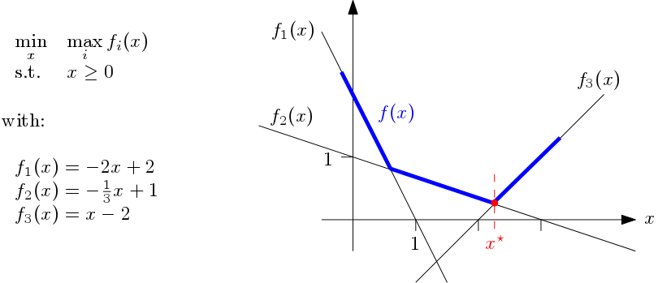
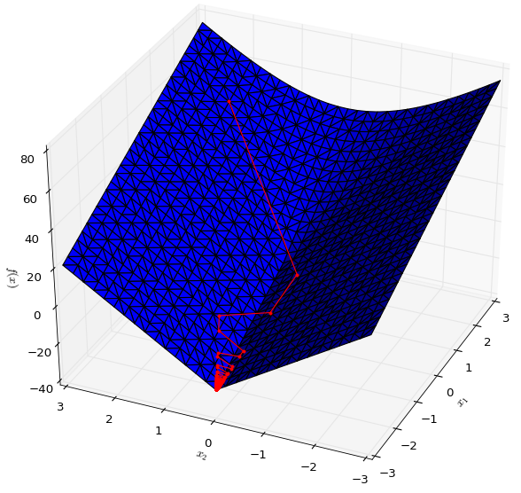
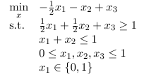

# nsopy - non-smooth optimization in Python

nsopy is a Python library implementing a set of first order methods to solve non-smooth, constrained convex optimization models.

## Installation

```bash
pip install nsopy
```

## Usage
### Quick Example

We seek to minimize a function obtained by taking the `max` over a set of affine functions. 
The feasible set considered is the set of non-negative real numbers, i.e., 
for which the projection operation is straightforward. 
<p align="center">
  
</p>

It is straightforward to see that the optimum is at `x* = 2.25`; we can solve this optimization problem numerically as follows:
~~~~
import numpy as np

def oracle(x_k):
    # evaluation of the f_i components at x_k
    fi_x_k = [-2*x_k + 2,  -1.0/3*x_k + 1,  x_k - 2]

    f_x_k = max(fi_x_k)  # function value at x_k

    diff_fi = [-2, -1.0/3.0, 1]  # gradients of the components
    max_i = fi_x_k.index(f_x_k)
    # subgradient at x_k is the gradient of the active function component; cast as (1x1 dimensional) np.array
    diff_f_xk = np.array([diff_fi[max_i], ])  

    return 0, f_x_k, diff_f_xk

def projection_function(x_k):
    if x_k is 0:
        return np.array([0,])
    else:
        return np.maximum(x_k, 0)
~~~~
Instantiation of method and logger, solve and print
~~~~
from nsopy.methods.subgradient import SubgradientMethod
from nsopy.loggers import GenericMethodLogger

method = SubgradientMethod(oracle, projection_function, stepsize_0=0.1, stepsize_rule='constant', sense='min')
logger = GenericMethodLogger(method)

for iteration in range(200):
    method.step()
~~~~
Result:
~~~~
>>> print(logger.x_k_iterates[-5:])

[2.1999999999999904, 2.216666666666657, 2.2333333333333236, 2.2499999999999902, 2.266666666666657]
~~~~


## Available Methods

* **Standard Subgradient Method**

~~~~ 
SubgradientMethod(oracle, projection_function, dimension=0, stepsize_0=1.0, stepsize_rule='1/k', sense='min')
~~~~
Stepsize rules valiable: `stepsize_rule: ['constant', '1/k', '1/sqrt(k)']`

* **Quasi-Monotone Methods**

Implementation of double simple averaging, and triple averaging methods from Nesterov's paper on [quasi-monotone methods](http://link.springer.com/article/10.1007/s10957-014-0677-5). 

~~~~ 
SGMDoubleSimpleAveraging(oracle, projection_function, dimension=0, gamma=1.0, sense='min')
SGMTripleAveraging(oracle, projection_function, dimension=0, variant=1, gamma=1.0, sense='min'):
~~~~

Variants of `SGMTripleAveraging` available: `variant: [1, 2]`

* **Universal Gradient Methods**

Implementation of Nesterov's [universal gradient methods](http://link.springer.com/article/10.1007/s10107-014-0790-0), primal, dual and fast versions.

~~~~
UniversalPGM(oracle, projection_function, dimension=0, epsilon=1.0, averaging=False, sense='min')
UniversalDGM(oracle, projection_function, dimension=0, epsilon=1.0, averaging=False, sense='min'):        
UniversalFGM(oracle, projection_function, dimension=0, epsilon=1.0, averaging=False, sense='min'):
~~~~

* **Cutting Planes Method**

*Warning*: this method requires `gurobipy`; if you are an academic, you can get a free license [here](http://www.gurobi.com/academia/for-universities]). 

~~~~
CuttingPlanesMethod(oracle, projection_function, dimension=0, epsilon=0.01, search_box_min=-10, search_box_max=10, sense='min')
~~~~

The parameter `epsilon` is the absolute required suboptimality level `|f_k - f*|` used as a stopping criterion. Note that a search box needs to be specified.


* **Bundle Method**

*Warning*: this method requires `gurobipy`; if you are an academic, you can get a free license [here](http://www.gurobi.com/academia/for-universities]). 

Implementation of a basic variant of the bundle method. 

~~~~
BundleMethod(oracle, projection_function, dimension=0, epsilon=0.01, mu=0.5, sense='min'):
~~~~


## Important Remarks

* Methods have to either be instantiated with the appropriate dimension argument, or implement a special case for 0. 
The basic usage example above illustrates an oracle implementing such a special case. 
For this example, alternatively one could have instantiated the solution method with `dimension = 1`.  

* The first-order oracle must also provide a projection function; [here is a list of cases](docs/img/simple_projections.png) for which 
the projection operation is computationally inexpensive.

* Currently, all methods are implemented in Python. Numerical performance is not optimized, but they may
be still useful for quick comparisons or for applications in which the main computational burden is in
evaluating the first order oracle.


## Advanced Examples

* See [analytical example](./notebooks/AnalyticalExample.ipynb) for a more challenging optimization model.
<p align="center">
  
</p>


* How to get [approximate solutions to structured MILPs](./notebooks/ApplicationToDuality.ipynb) using Lagrangian duality.
<p align="center">
  
</p>


We can also use these methods to decompose stochastic multistage 
mixed integer programs ([preview](https://github.com/robin-vjc/nsopy-stoch)), which in turn allows 
the computation of approximate solutions to these models on distributed environments (e.g., on cloud infrastructure).


### Contributing

Contributions and pull requests are very much welcome. The [TODO](TODO.txt) contains a number of tasks whose completion would be helpful.
