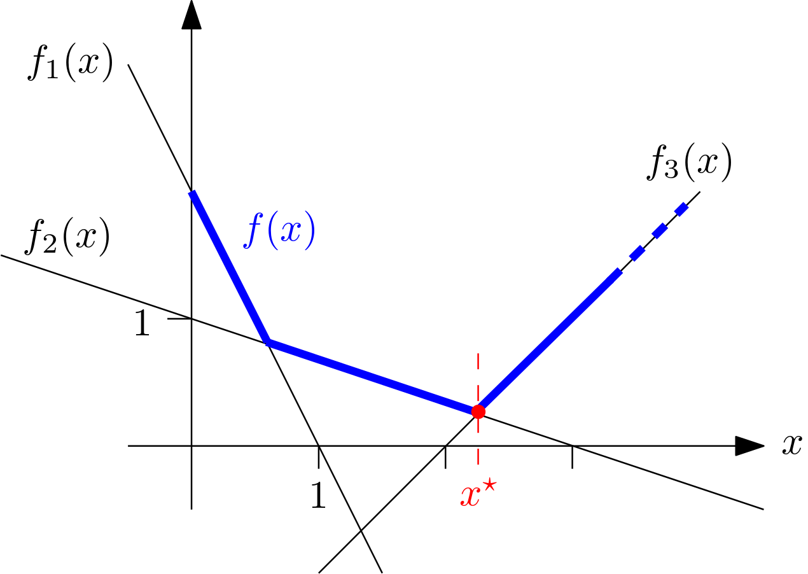

Welcome to nsopy documentation!
===================================

**nsopy** is a Python library implementing a set of first order methods to solve non-smooth, constrained convex optimization models.

It is applicable to problems of the form

.. math::

    \begin{array}{ll}
    \min & f(x)\\
    \mathrm{s.t.} & x \in \mathbb{X}
    \end{array}

where:

* :math:`f(x)` is convex, but not necessarily differentiable
* :math:`\mathbb{X} \subseteq \mathbb{R}^n` is convex

Installation
------------

.. code-block:: console

   $ pip install nsopy

.. _example:

Example
-------

We seek to minimize the following piece-wise affine function:

.. math::

    \begin{array}{ll}
    \min\limits_x & \max_i f_i(x)\\
    \mathrm{s.t.} & x \geq 0
    \end{array}

with

.. math::

    \begin{array}{ll}
    f_1(x) = -2x + 2\\
    f_2(x) = -\frac{1}{3}x + 1\\
    f_3(x) = x - 2
    \end{array}

We can visualize the problem and note that the solution is :math:`x^\star = 2.25`.

**Constraints:** In the minimization problem we require that solutions satisfy :math:`x \geq 0`.
The blue color is used in the figure to indicate this.
To enable **nsopy** to satisfy this, we need to supply it with a **projection function**: given a point :math:`x` that
does not necessarily satisfy :math:`x \geq 0`, it returns the *closest* (in :math:`\ell_2` sense) point that does.

For this example:

.. code-block:: python

    import numpy as np

    def projection_function(x_k):
        return np.maximum(x_k, 0)

.. note::

   A list of common projection functions can be found `here <https://github.com/robin-vjc/nsopy/blob/master/docs/img/simple_projections.png>`

We define the function to optimize:

.. code-block:: python

    def oracle(x_k):
        # evaluation of the f_i components at x_k
        fi_x_k = [-2*x_k + 2,  -1.0/3*x_k + 1,  x_k - 2]

        f_x_k = max(fi_x_k)  # function value at x_k

        diff_fi = [-2, -1.0/3.0, 1]  # gradients of the components
        max_i = fi_x_k.index(f_x_k)
        # subgradient at x_k is the gradient of the active function component; cast as (1x1 dimensional) np.array
        diff_f_xk = np.array([diff_fi[max_i], ])

        return 0, f_x_k, diff_f_xk

And solve:

.. code-block:: python

    from nsopy.methods.subgradient import SubgradientMethod
    from nsopy.loggers import GenericMethodLogger

    method = SubgradientMethod(oracle, projection_function, dimension=1, stepsize_0=0.1, stepsize_rule='constant', sense='min')
    logger = GenericMethodLogger(method)

    for iteration in range(200):
        method.step()

Inspect the solution:

.. code-block:: python

    print(logger.x_k_iterates[-5:])
    >>> [2.1999999999999904, 2.216666666666657, 2.2333333333333236, 2.2499999999999902, 2.266666666666657]

Check out the :doc:`usage` section for further information, including how to :ref:`installation` the project.

.. note::

   This project is under active development.

Contents
--------

.. toctree::

   usage
   api